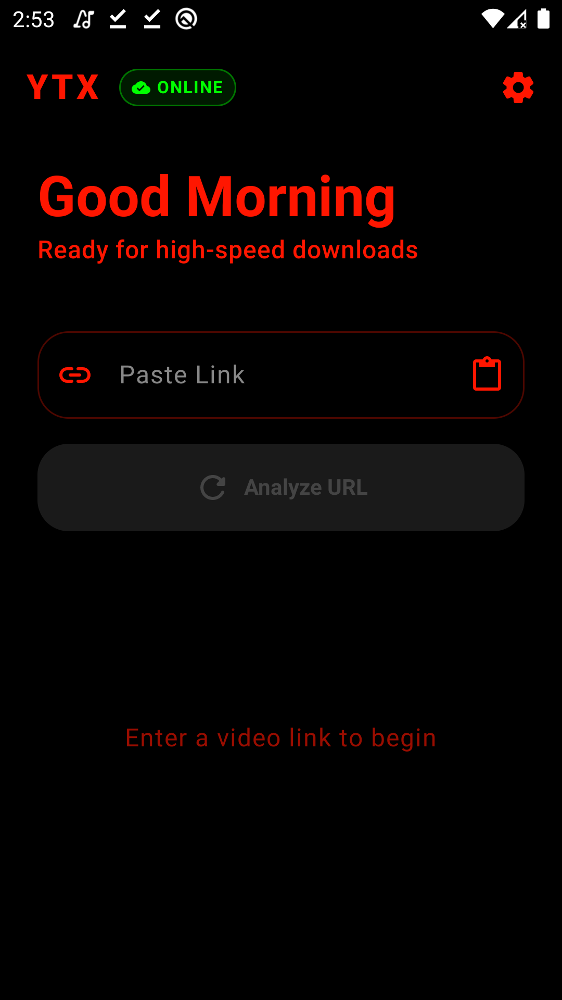
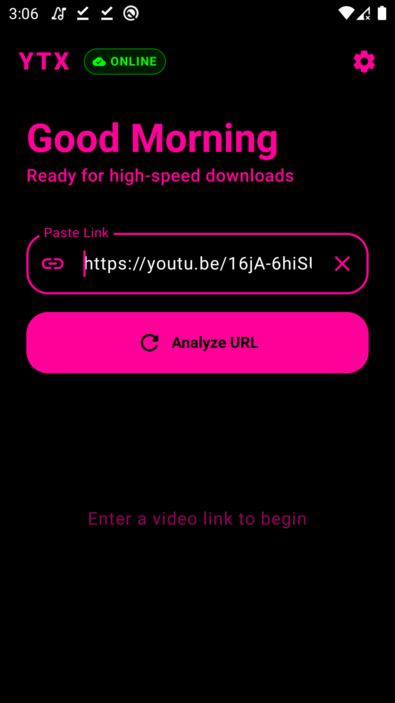
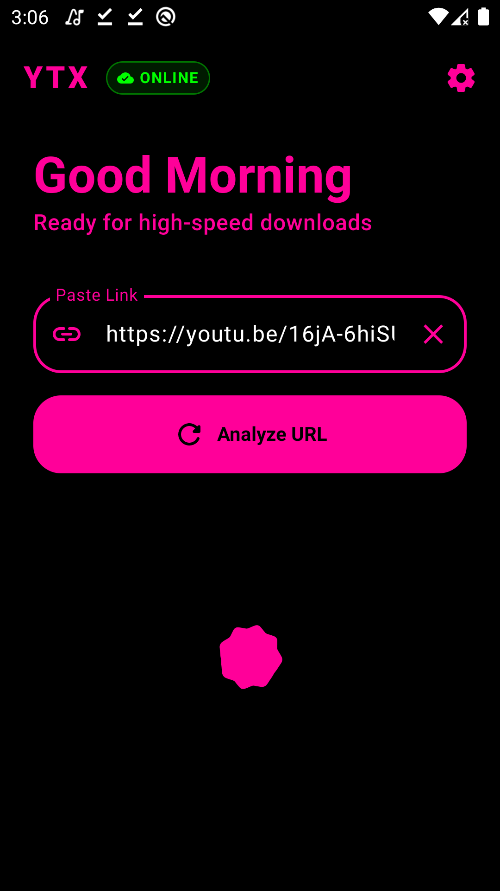
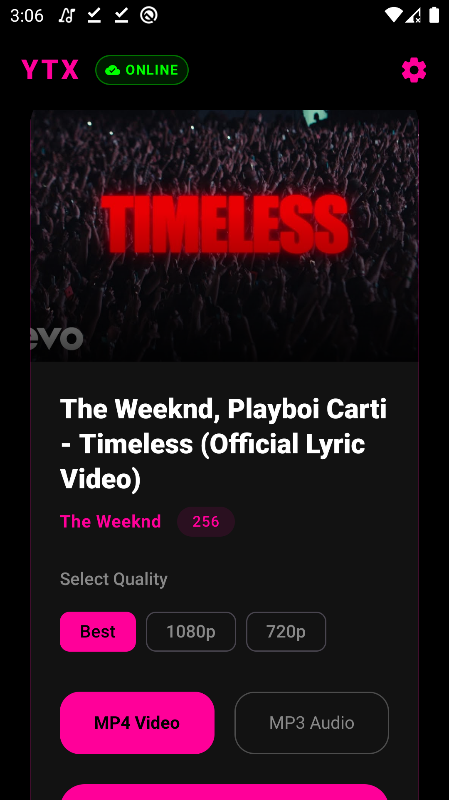
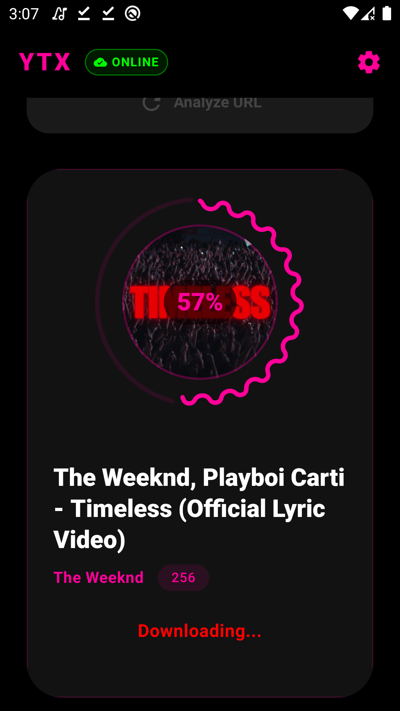
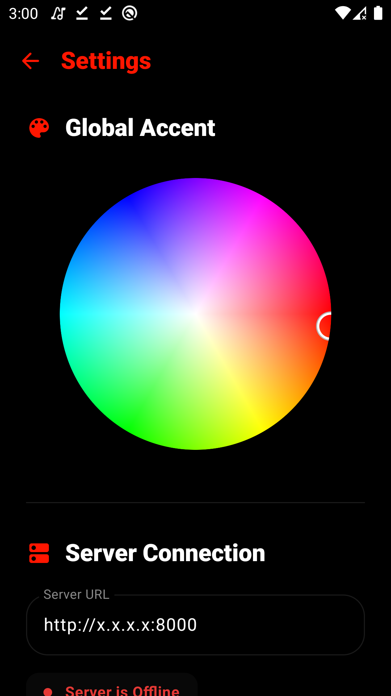
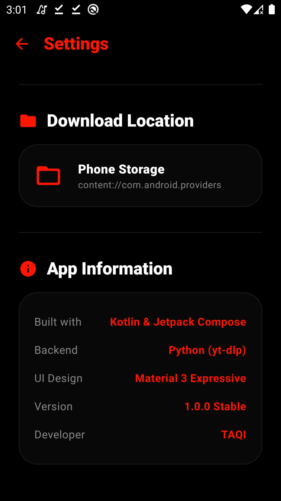

# 🎧 YTX Server

YTX Server is a **lightweight FastAPI + yt-dlp backend** for downloading YouTube videos or audio with **live progress updates**.  
It powers the **YTX Downloader App** for Android.

---

## 🚀 Features

- Download **MP3 audio** or **MP4 video**
- **Live download progress** via WebSocket
- Automatic **filename cleaning**
- **Thumbnail embedding**
- **Metadata embedding** (Title + Artist)
- Safe filenames (no Windows-breaking characters)

---

## 📦 Requirements

- **Python 3.9+**
- **FFmpeg** installed and added to system PATH  
  Download: [FFmpeg](https://ffmpeg.org/download.html)

## 📸 App Screenshots

You can showcase your app images like this:

  
*Home Screen*
  
*Link box preview*
  
*Loading MetaData*
  
*Example MetaData Preview*
  
*Download video/audio with live progress*
  
*Settings and options*
  
*Settings and options*

### Python Dependencies

```bash
pip install fastapi uvicorn yt-dlp mutagen requests
pip install yt-dlp[default]  # for full YouTube support
📥 Downloading the Server

Clone the repository:

git clone REPO_LINK
cd project-folder

Or download ZIP from GitHub → Extract → Open folder.

📁 Project Structure
project/
│
├── s2.py             # Main FastAPI server
├── downloads/        # Folder to store downloaded files
└── README.md
▶️ Running the Server

Open terminal inside the project folder:

uvicorn s2:app --host 0.0.0.0 --port 8000

You should see:

Uvicorn running on http://0.0.0.0:8000

Your server is now live.

🔌 Server Endpoints
Ping Server
GET /ping

Response:

{"status": "online"}
Get Video Metadata
GET /metadata?url=VIDEO_URL

Example:

http://localhost:8000/metadata?url=https://youtu.be/dQw4w9WgXcQ

Response:

{
  "title": "Never Gonna Give You Up",
  "thumbnail": "https://i.ytimg.com/vi/dQw4w9WgXcQ/hqdefault.jpg",
  "author_name": "Rick Astley",
  "duration": 213
}
Start Download (WebSocket)
ws://localhost:8000/download

Send JSON:

{
  "url": "VIDEO_URL",
  "format": "mp3"
}

Supported formats:

mp3

mp4

Live progress will be sent over the WebSocket.

Download Finished File
GET /download_file?filename=FILE_NAME

Example:

http://localhost:8000/download_file?filename=NeverGonnaGiveYouUp.mp3
📂 File Storage

All downloads are saved in the downloads/ folder.

Filename cleaning example:

Original:

Example | Slowed+Reverb 🎶

Becomes:

Example Slowed Reverb.mp3
📱 Installing the YTX App

Go to GitHub → Releases

Download the latest APK

Install on Android

Allow "Unknown Sources" if blocked

Example:

Releases → YTX_v1.0.apk

⚠️ This app requires a personal server to function.

⚠️ Troubleshooting

FFmpeg not found → Make sure FFmpeg is installed and added to PATH.

yt-dlp extraction warning → Run:

pip install yt-dlp[default]
💡 About

Built with:

FastAPI

yt-dlp

Mutagen

WebSockets

Provides a fast backend for YouTube downloads with live progress updates.

❤️ Credits

Created by CodeX
Part of the YTX Project